# TOC
- [Questions](#questions)
  * [Practice 1](#practice-1)
    + [Tips](#tips)
    + [Code](#code)
  * [Practice 2](#practice-2)
    + [Code](#code-1)
  * [Practice 3](#practice-3)
    + [Tips](#tips-1)
    + [Code](#code-2)
  * [Practice 4](#practice-4)
    + [Code](#code-3)
  * [Practice 5](#practice-5)
    + [Code](#code-4)
  * [Practice 6](#practice-6)
    + [Code](#code-5)

# Questions

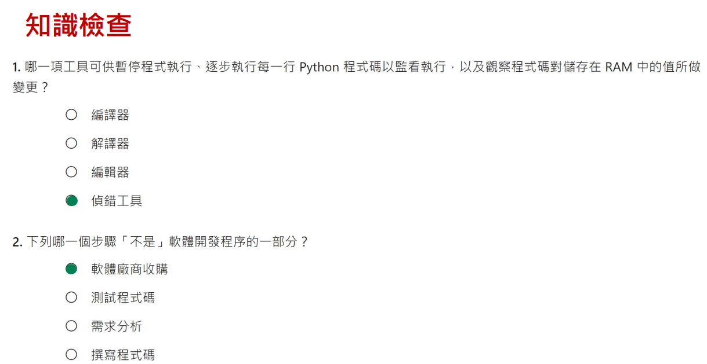
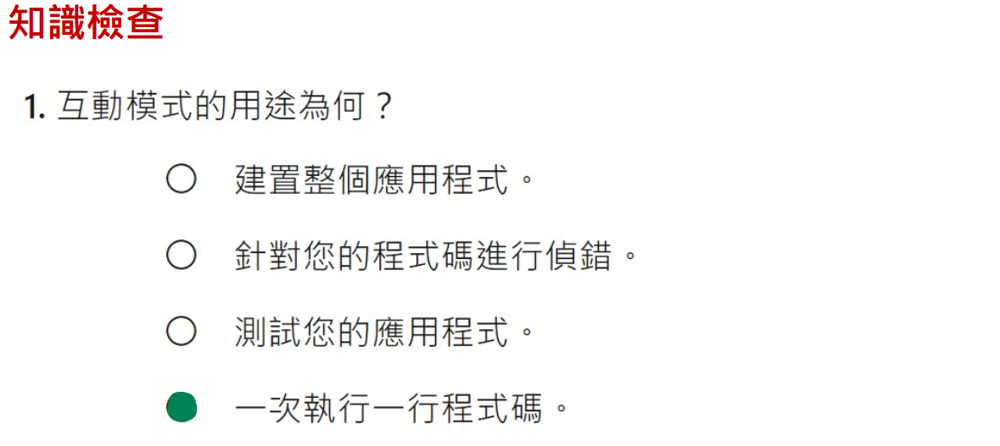
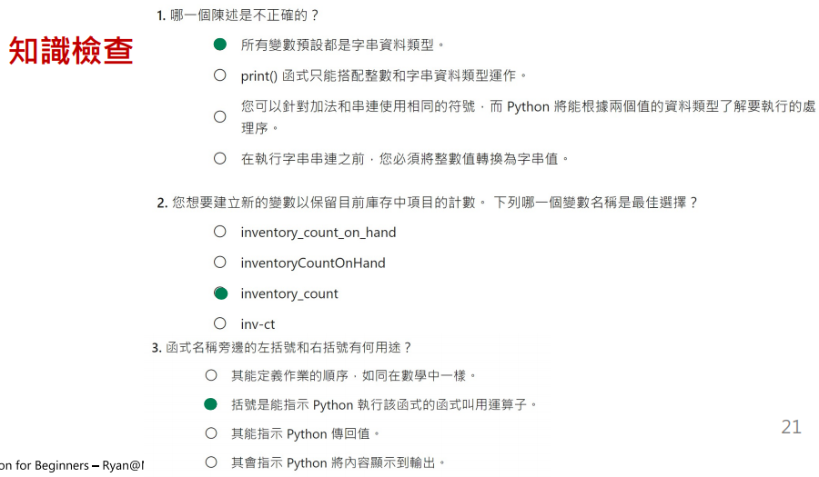
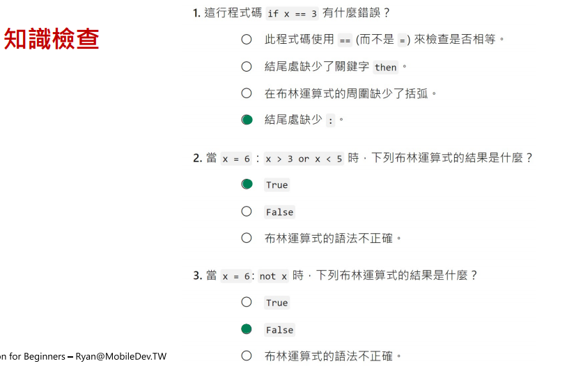
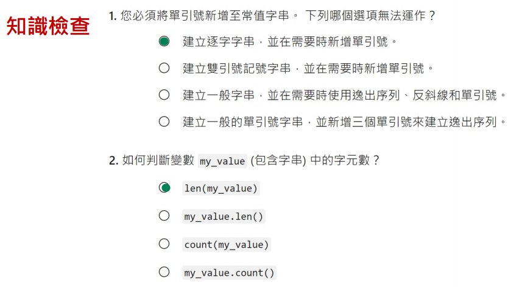
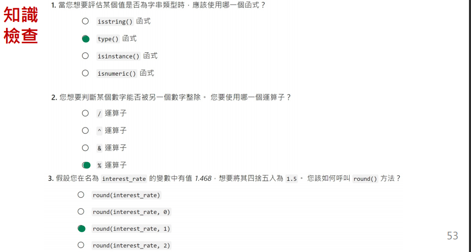
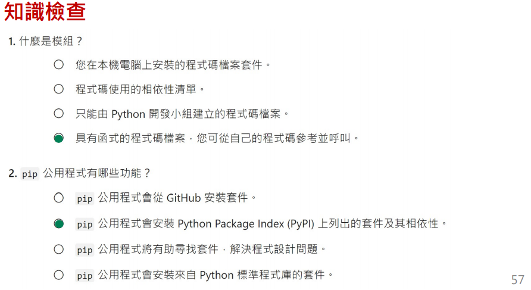
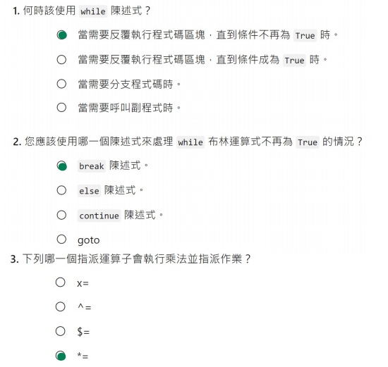
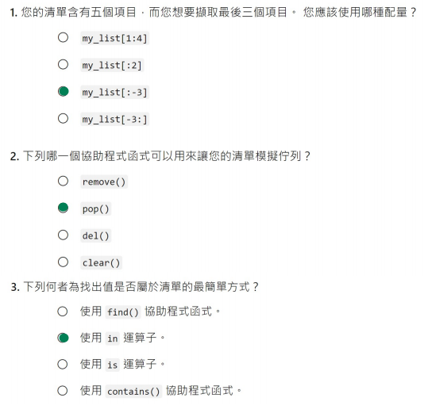
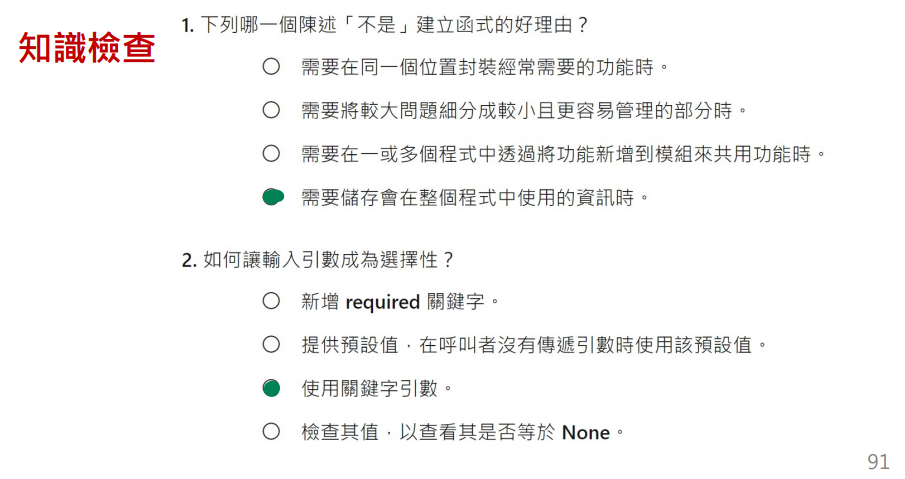


## Practice 1

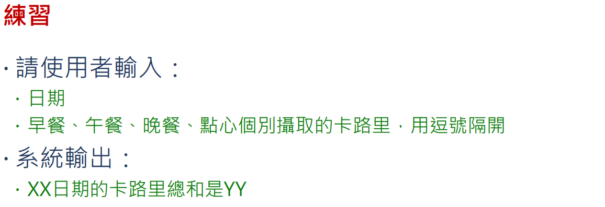

### Tips

`input = 'good night'`

```python
a = input().split()
# a: ['good', 'night']
```

### Code

[Code](calory.py)

```python
print('')
date = input('Date: ')

calories = list(map(lambda x: int(x), input("Calories: ").split(',')))

print(f"{date}日期的卡路里總和是{sum(calories)}")
```

<br/>
<div align="right">
    <b><a href="#toc">↥ back to top</a></b>
</div>
<br/>

## Practice 2

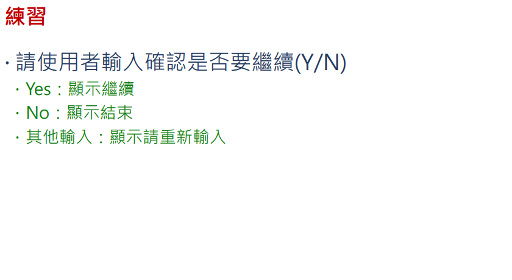

### Code

[Code](userInput.py)

```python
while True:

    oper = input("Continue? (Yes/No): ")

    if oper == 'Yes':
        print("Continue")
        continue

    if oper == "No":
        print("End")
        break

    print("Please type again")
```
<br/>
<div align="right">
    <b><a href="#toc">↥ back to top</a></b>
</div>
<br/>

## Practice 3

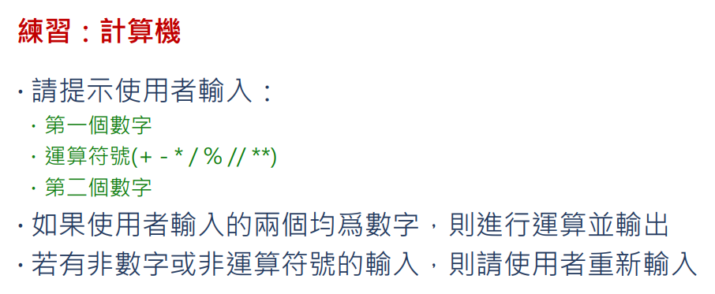

### Tips

eval() -> evaluate the string
~   Execute the String

```python
print(3 + 3) # 6
print('3 + 3') # 3 + 3
print(eval(3 + 3)) # Error
print(eval('3 + 3')) # 6
```

### Code

[Code](calculator.py)

```python
first_number = input("First Number: ")
if not first_number.isdigit():
    print("number not digit, please type again")
    self.run(self)
    return

operation = input("Operation: ")
if operation not in "+ - * / % // **".split():
    print("operation not permitted, please type again")
    self.run(self)
    return

second_number = input("Second Number: ")
if not second_number.isdigit():
    print("number not digit, please type again")
    self.run(self)
    return


print(eval(first_number + operation + second_number))
```

<br/>
<div align="right">
    <b><a href="#toc">↥ back to top</a></b>
</div>
<br/>

## Practice 4

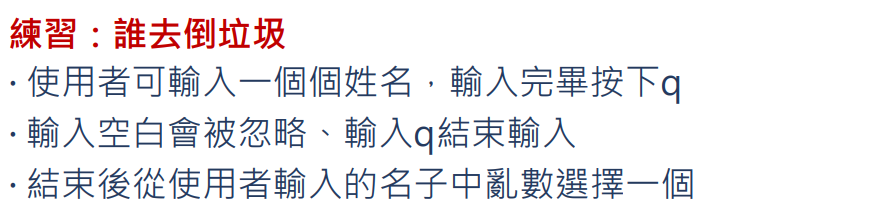

### Code

[Code](duty.py)

```python
from os import urandom
import sys

members = []

while True:

    user_input = input('Name: ')

    if ' ' == user_input:
        continue 

    if 'q' == user_input:
        break 

    members.append(user_input)


rand = int.from_bytes(urandom(10), sys.byteorder)%len(members)
print(f"今天是{members[rand]}倒垃圾")
```

<br/>
<div align="right">
    <b><a href="#toc">↥ back to top</a></b>
</div>
<br/>

## Practice 5

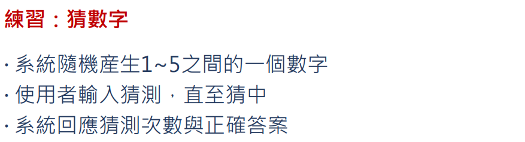

### Code 

[Code](guess.py)

```python
from os import urandom
rand = int(urandom(1).hex(), 16) % 4 + 1
count = 1

while True if int(input("Guess number: ")) != rand else False:
    count += 1

print(f'Time guessed: {count}\nRight answer: {rand}')
```
<br/>
<div align="right">
    <b><a href="#toc">↥ back to top</a></b>
</div>
<br/>

## Practice 6

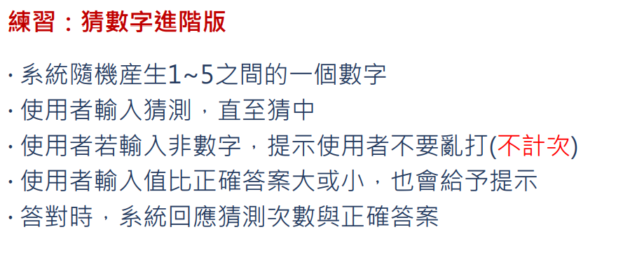

### Code

[Code](guess_revange.py)

```python
while True:
    user_input = input("Guess number: ")
    
    if not user_input.isdigit():
        print("Wrong input, please type again")
        continue

    user_input = int(user_input)

    if user_input == rand:
        break

    print('Too big') if user_input > rand else print('Too small')

    count += 1

print(f'Time guessed: {count}\nRight answer: {rand}')
```

<br/>
<div align="right">
    <b><a href="#toc">↥ back to top</a></b>
</div>
<br/>